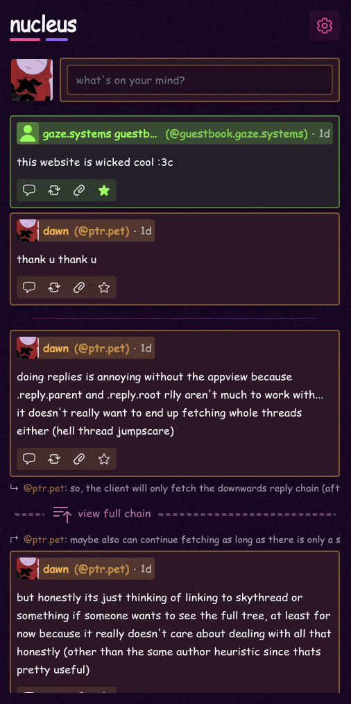

## nucleus

a WIP replies timeline only (eg. it only shows replies to your posts and your own posts) appview-less (it does not use the bluesky appview, but rather uses [microcosm](https://www.microcosm.blue/) services) bluesky client. it is implemented in SvelteKit and uses [atcute](https://tangled.org/@mary.my.id/atcute).

### todos

- [ ] properly implement auth (current state is just for deving) (we want oauth only)
- [ ] implement popouts for showing full chains instead of expanding in the timeline
- [ ] implement moderation (mutes, muted words etc., use blocks from `app.bsky.graph.block`)
- [ ] profile view popout
- [ ] consider showing posts that mention / quote the user..
- [ ] notifications when replied to (and mentioned and quoted?)
- [ ] basic filtering settings for the timeline (dont show self posts and if we implement mentioned / quoted add toggles for those as well)
- [ ] use bsky video CDN instead of linking to blob
- [ ] dont use listRecords to fetch own posts. we should have an index for this (red dwarf will have this so just piggyback off of that?)
- [ ] consider implementing feeds
- [ ] use jetstream to listen for own posts / likes / etc. made from other clients ? (pretty lowprio though, not sure if worth it, can just refresh)
